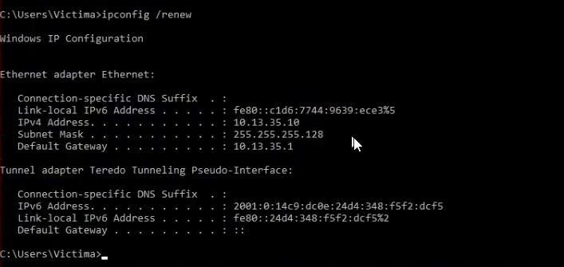
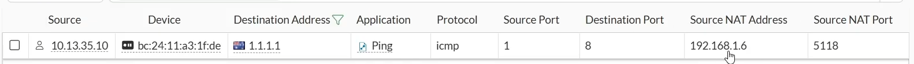
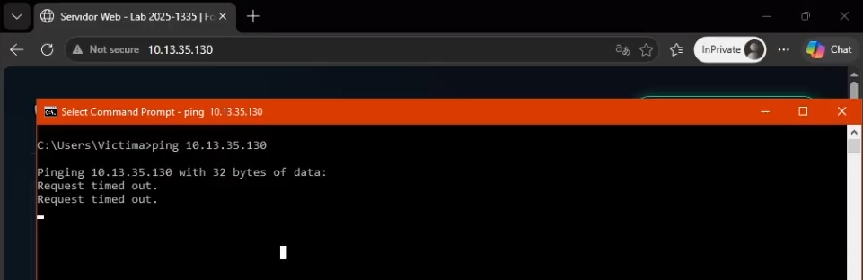
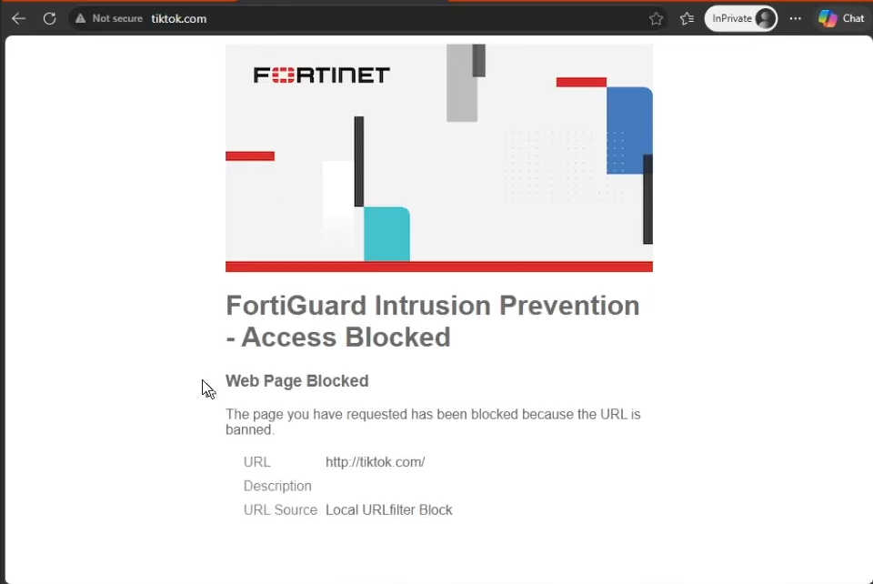
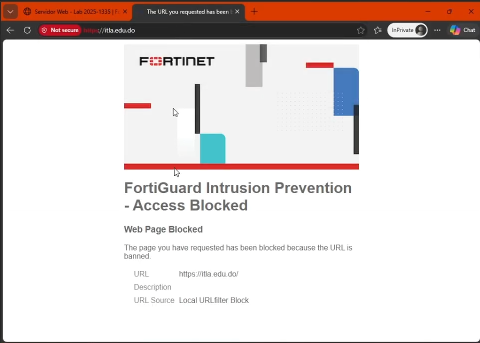
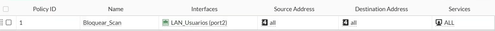
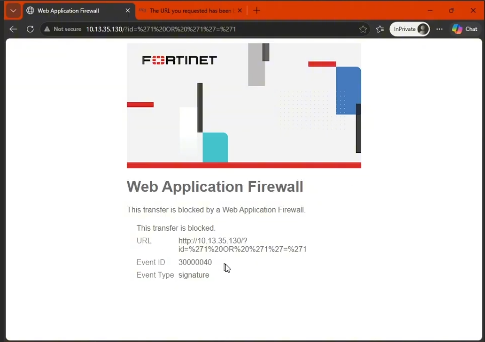

# 🛡️ Diseño e Implementación de Arquitectura Perimetral Segura con FortiGate
**Institución:** Instituto Tecnológico de Las Américas (ITLA)  
**Estudiante:** Anthony Moisés De Los Santos Capellán  
**Matrícula:** 2025-1335  
**Asignatura:** Seguridad de Redes  
**Entorno de Simulación:** Proxmox VE / PNETLab  

---

## 🎬 Demostración y Defensa Técnica en Video
Para visualizar la explicación arquitectónica, comprobación de identidad, fecha/hora en tiempo real y pruebas de estrés de los controles perimetrales (NAT, WAF, DoS y Filtros L7), acceda a la sustentación en video:

[-FF0000?style=for-the-badge&logo=youtube&logoColor=white)](https://youtu.be/RjTBIji5wCY)

> 💡 **Nota para el evaluador:** El video incluye la demostración de la interfaz gráfica (GUI), validación de DHCP/Enrutamiento, interrupción de llamadas VoIP de WhatsApp, bloqueo de redes sociales por SNI y la interrupción de ataques de inyección SQL en la capa de aplicación.

---

## 📋 1. Objetivo de la Red

El objetivo principal de esta infraestructura es diseñar, implementar y documentar una topología de red perimetral altamente segura utilizando un firewall **FortiGate (v7.x)** como núcleo de enrutamiento y control de acceso. 

La arquitectura busca garantizar el principio de **menor privilegio** y la **segmentación de zonas de red (Zero Trust Foundation)** mediante el aislamiento del tráfico de usuarios finales (`LAN_Usuarios`) respecto a los servicios críticos internos (`LAN_Servidores` / DMZ). Asimismo, la red implementa controles de seguridad de **Capa 7 (Aplicación)** para mitigar fugas de datos, bloquear ataques de denegación de servicio (DoS/DDoS), evitar el uso de aplicaciones de ocio o colaboración no autorizadas y blindar los servicios web locales contra vectores de ataque como inyecciones SQL (SQLi).

---

## 🗺️ 2. Topología y Enrutamiento

La red está segmentada en tres zonas de seguridad principales basadas en el direccionamiento IP derivado de la matrícula **2025-1335** (`10.13.35.0/24`), dividiendo el espacio de direcciones mediante VLSM (Variable Length Subnet Masking).

### 🏷️ Tabla de Interfaces y Segmentación
| Interfaz FortiGate | Alias / Zona | Dirección IP / Máscara | Segmento CIDR | Función y Rol Perimetral |
| :--- | :--- | :--- | :--- | :--- |
| **port1** | `WAN_Internet` | DHCP (Nube PNETLab) | N/A | Interfaz de salida pública (Untrusted) / Gateway WAN |
| **port2** | `LAN_Usuarios` | `10.13.35.1` / `255.255.255.128` | `10.13.35.0/25` | Red interna de clientes de trabajo (Trusted LAN) |
| **port3** | `LAN_Servidores` | `10.13.35.129` / `255.255.255.240` | `10.13.35.128/28` | Zona Desmilitarizada (DMZ) para hosting local |

### 💻 Tabla de Nodos y Direccionamiento
| Nodo / Equipo | Sistema Operativo | Interfaz Conectada | Dirección IP Asignada | Gateway por Defecto |
| :--- | :--- | :--- | :--- | :--- |
| **Firewall Perimetral** | FortiOS (FortiGate VM) | `port1`, `port2`, `port3` | Ver tabla superior | Gateway de ISP (DHCP) |
| **Cliente de Usuario** | Windows 10 Pro (VM) | `port2` (Switch LAN) | `10.13.35.10` - `.100` *(DHCP)* | `10.13.35.1` |
| **Servidor Web** | Kali Linux Docker (Nginx) | `port3` (Switch DMZ) | `10.13.35.130/28` *(Estática)* | `10.13.35.129` |

### 🧭 Enrutamiento y Traducción de Direcciones (NAT)
* **Enrutamiento Estático:** Se implementó una ruta estática por defecto (`0.0.0.0/0`) apuntando a la puerta de enlace dinámica de la interfaz `port1` (`WAN_Internet`), permitiendo que el tráfico saliente alcance redes exteriores.
* **NAT Perimetral (PAT / Source NAT):** Todo el tráfico originado desde la red de usuarios (`LAN_Usuarios`) con destino a Internet es traducido enmascarando la dirección IP privada por la IP exterior del firewall en la interfaz WAN, utilizando traducción de puertos de origen (Port Address Translation).

---

## ⚙️ 3. Configuraciones Utilizadas y Matriz de Control

La seguridad de la infraestructura se rige por un modelo de políticas de firewall estrictas y perfiles de Gestión Unificada de Amenazas (UTM) administradas en su totalidad mediante la GUI de FortiOS.

### 🧱 Políticas de Firewall (Firewall Policies)
1. **`Acceso_Internet` (ID: 1):**
   * **Origen:** `LAN_Usuarios` (`port2`) | **Destino:** `WAN_Internet` (`port1`).
   * **Tráfico:** Permite navegación web saliente (`HTTP`, `HTTPS`, `DNS`, `PING`).
   * **NAT:** Habilitado (Source NAT / PAT).
   * **Perfiles UTM Aplicados:** `Web Filter` (Filtro corporativo), `Application Control` (Bloqueo VoIP), `SSL Inspection` (`no-inspection` / `certificate-inspection`).
2. **`Usuarios_a_Servidores_HTTP` (ID: 2):**
   * **Origen:** `LAN_Usuarios` (`port2`) | **Destino:** `LAN_Servidores` (`port3`).
   * **Tráfico:** **Exclusivamente puerto TCP 80 (HTTP)**. Se bloquea cualquier otro intento de conexión interna (ICMP/Ping, SSH, FTP, etc.).
   * **Modo de Inspección:** Proxy-based.
   * **Perfiles UTM Aplicados:** `WAF Profile` (Web Application Firewall).
3. **`Implicit Deny` (ID: 0):**
   * Bloqueo denegado por defecto para cualquier flujo de red no autorizado explícitamente en las reglas anteriores.

### 🛡️ Perfiles de Seguridad Perimetral (UTM / L7 / DoS)
* **Filtro Web (Web Filter - L7 SNI):** 
  * *Filtro Estático por URL (Wildcard):* Bloqueo total al patrón `*itla.edu.do*` (dominios y subdominios).
  * *Mitigación Compensatoria (Redes Sociales):* Bloqueo por categorías y dominios para plataformas como *Facebook*, *Instagram*, *TikTok* y *X*. *(Nota de Arquitectura: Se implementó mediante filtrado SNI de Capa 7 en el Web Filter para garantizar la continuidad operativa en entornos de evaluación virtual sin licencia de nube, esquivando falsos positivos de FortiGuard sobre motores de búsqueda de trabajo como Google/Bing)*.
* **Control de Aplicaciones (Application Control):**
  * Bloqueo de la categoría y firmas de colaboración/VoIP, interrumpiendo las sesiones de llamadas de voz y videollamadas de **WhatsApp** (`WhatsApp_VoIP.Call`).
* **Protección DoS (DoS Policy):**
  * Aplicada en el puerto de ingreso local (`port2`).
  * **Anomalías L4 activadas en modo `Block`:** Escaneo de puertos TCP (`tcp_port_scan` - Umbral: 100), escaneo de puertos UDP (`udp_scan` - Umbral: 100) y barridos de red ICMP (`icmp_sweep` - Umbral: 50).
* **Firewall de Aplicaciones Web (WAF):**
  * Aplicado en la política interna hacia la zona DMZ (`port3`).
  * Firmas activadas en modo **Block** para interceptar peticiones con patrones de **Inyección SQL (SQLi)** y Cross-Site Scripting (XSS).

---

## 📸 4. Evidencias de Configuración y Demostración Técnica

A continuación se presentan las evidencias visuales extraídas directamente del entorno de laboratorio durante las pruebas de auditoría y validación de reglas:

### 🖥️ Evidencia 1: Asignación de IP, DHCP y Enrutamiento en Windows 10

> **Explicación Técnica:** En la consola de comandos de la máquina cliente (`LAN_Usuarios`), se verifica mediante `ipconfig /renew` que el servidor DHCP del FortiGate asigna exitosamente la dirección IP privada dentro del rango `.10` - `.100` en el segmento `/25` (`10.13.35.0/25`), configurando correctamente como puerta de enlace predeterminada (`Default Gateway`) la IP perimetral `10.13.35.1`.

---

### 🌐 Evidencia 2: Operatividad del NAT Perimetral (Source NAT)

> **Explicación Técnica:** Captura del panel de control **FortiView Sessions** durante el envío continuo de paquetes ICMP desde el cliente local hacia Internet (`1.1.1.1`). Se evidencia en la columna `Source NAT Address` cómo el firewall procesa la sesión bajo la política ID 1 y enmascara el paquete sustituyendo la IP de origen privada por la dirección exterior asignada a la interfaz WAN, demostrando traducción de direcciones funcional en Capa 3/4.

---

### 🔒 Evidencia 3: Aislamiento L4 - Acceso HTTP permitido y bloqueo de Ping a DMZ

> **Explicación Técnica:** Se corrobora la granularidad del firewall al evaluar la política ID 2 (`Usuarios_a_Servidores_HTTP`). Al ingresar en el navegador a `http://10.13.35.130`, el servidor Nginx en la zona DMZ responde exitosamente. Sin embargo, al ejecutar un comando `ping 10.13.35.130` en la terminal, el tráfico es descartado (*Request timed out*), probando que el firewall restringe cualquier protocolo que no sea estrictamente TCP 80.

---

### 🛑 Evidencia 4: Bloqueo de Redes Sociales y WhatsApp VoIP

> **Explicación Técnica:** Demostración del corte de sesiones en Capa 7. Al intentar acceder a plataformas de ocio como TikTok, el FortiGate intercepta la petición SNI e imprime el aviso de **"Web Page Blocked!"**. De forma equivalente, al iniciar una llamada por WhatsApp, el motor de Application Control identifica el flujo de medios VoIP y resetea la conexión instantáneamente preservando la navegación laboral en navegadores y buscadores.

---

### 🏫 Evidencia 5: Bloqueo Estático por URL (Dominio ITLA)

> **Explicación Técnica:** Captura de la interrupción de tráfico hacia el portal universitario. La regla estática de filtro URL configurada como comodín (`*itla.edu.do*`) evalúa cualquier petición HTTP/HTTPS hacia este dominio o sus subdominios y ejecuta una acción de bloqueo inmediata en la frontera perimetral.

---

### 🛡️ Evidencia 6: Prevención de Intrusiones - Mitigación de Escáneres DoS

> **Explicación Técnica:** Implementación y despliegue de la política de denegación de servicio (`Bloquear_Scan` - ID 1) en la frontera de la red de usuarios (`port2`). En esta configuración, se habilitaron los sensores L4 para la detección y bloqueo automático de tácticas de reconocimiento, cortando en seco intentos de barridos ICMP (`icmp_sweep`) y escaneos de puertos (`tcp_port_scan` / `udp_scan`), garantizando así que la topología interna no pueda ser descubierta por herramientas de pentesting no autorizadas.
---

### ⚡ Evidencia 7: Intercepción de Ataque de Inyección SQL (WAF Capa 7)

> **Explicación Técnica:** Validación de la seguridad en la zona de servidores. Desde el navegador del cliente de la LAN se inyecta una cadena maliciosa de prueba en la URL: `http://10.13.35.130/?id=1' OR '1'='1`. El Web Application Firewall (WAF) del FortiGate inspecciona la carga útil en el nivel de aplicación, detecta la sintaxis de SQL Injection, aborta la entrega al contenedor Nginx y devuelve al usuario un error **HTTP 403 Forbidden / Access Denied by Web Application Firewall**, protegiendo la integridad del servidor.

---
